# Catálogos y tablas de referencia del formulario (Mermaid)

Este documento enumera los catálogos y tablas de referencia que alimentan listas,
comboboxes y autopoblado en la aplicación. También agrega diagramas Mermaid para
cada catálogo. Referencia general de negocio: **Design document CM.pdf** en la
raíz del repositorio.

## Catálogos definidos en `settings.py`

### TAXONOMIA (categoría 1 → categoría 2 → modalidad)
```mermaid
flowchart TD
    tax["settings.TAXONOMIA"]
    tax --> c1a["Riesgo de Fraude"]
    tax --> c1b["Riesgo de Ciberseguridad"]
    tax --> c1c["Riesgo Legal y Cumplimiento"]

    c1a --> c1a_1["Fraude Interno"]
    c1a --> c1a_2["Fraude Externo"]
    c1a_1 --> c1a_1m1["Apropiación de fondos"]
    c1a_1 --> c1a_1m2["Transferencia ilegal de fondos"]
    c1a_1 --> c1a_1m3["Solicitud fraudulenta"]
    c1a_1 --> c1a_1m4["Hurto"]
    c1a_1 --> c1a_1m5["Fraude de venta de productos/servicios"]
    c1a_2 --> c1a_2m1["Apropiación de fondos"]
    c1a_2 --> c1a_2m2["Estafa"]
    c1a_2 --> c1a_2m3["Extorsión"]
    c1a_2 --> c1a_2m4["Fraude en valorados"]
    c1a_2 --> c1a_2m5["Solicitud fraudulenta"]

    c1b --> c1b_1["Perdida de Confidencialidad"]
    c1b --> c1b_2["Perdida de Disponibilidad"]
    c1b --> c1b_3["Perdida de Integridad"]
    c1b_1 --> c1b_1m1["Robo de información"]
    c1b_1 --> c1b_1m2["Revelación de secreto bancario"]
    c1b_2 --> c1b_2m1["Destrucción de información"]
    c1b_2 --> c1b_2m2["Interrupción de servicio"]
    c1b_3 --> c1b_3m1["Modificación no autorizada de información"]
    c1b_3 --> c1b_3m2["Operaciones no autorizadas"]

    c1c --> c1c_1["Abuso del mercado"]
    c1c --> c1c_2["Conducta de mercado"]
    c1c --> c1c_3["Corrupción"]
    c1c --> c1c_4["Cumplimiento Normativo"]
    c1c_1 --> c1c_1m1["Conflicto de interés"]
    c1c_1 --> c1c_1m2["Manipulación de mercado"]
    c1c_2 --> c1c_2m1["Gestión de reclamos"]
    c1c_2 --> c1c_2m2["Malas prácticas de negocio"]
    c1c_3 --> c1c_3m1["Cohecho público"]
    c1c_3 --> c1c_3m2["Corrupción entre privados"]
    c1c_4 --> c1c_4m1["Implementación de normas"]
    c1c_4 --> c1c_4m2["Reportes y requerimientos regulatorios"]

    tax --> use_case["ui/frames/case.py: categoría 1/2/modalidad"]
    tax --> use_prod["ui/frames/products.py: categoría 1/2/modalidad"]
```

### CANAL_LIST
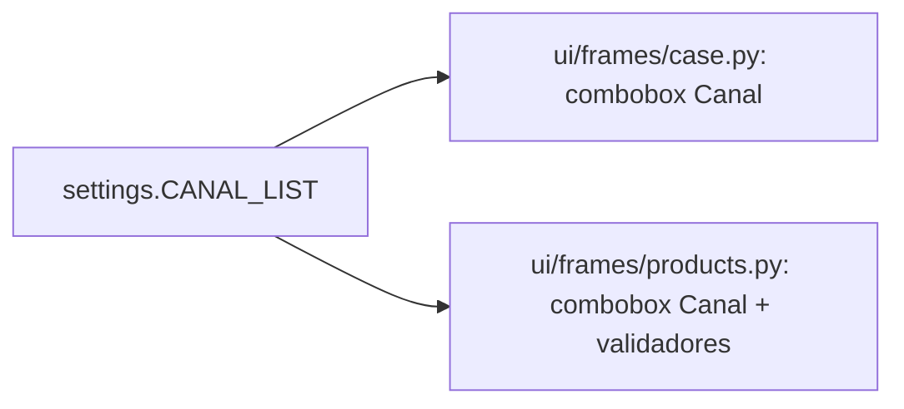

### PROCESO_LIST
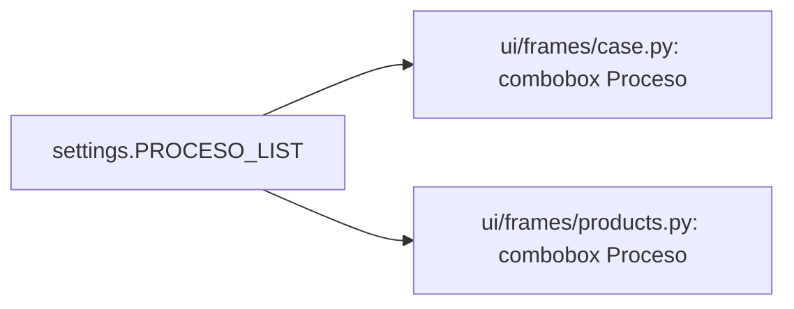

### TIPO_PRODUCTO_LIST
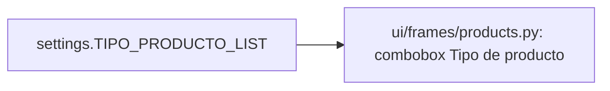

### TIPO_INFORME_LIST
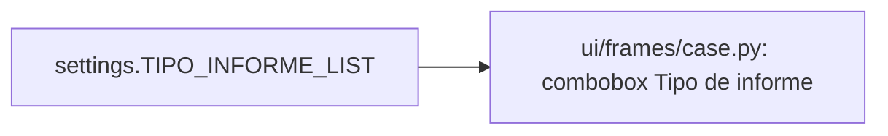

### TIPO_MONEDA_LIST


### TIPO_ID_LIST
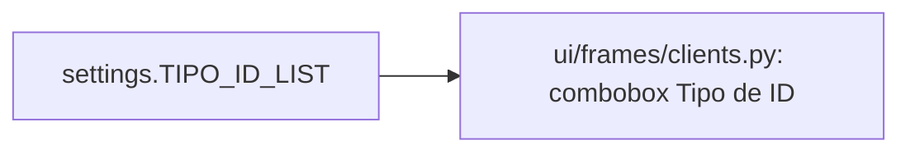

### FLAG_CLIENTE_LIST


### ACCIONADO_OPTIONS


### FLAG_COLABORADOR_LIST


### TIPO_FALTA_LIST
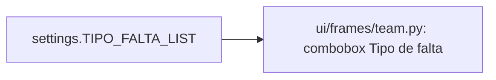

### TIPO_SANCION_LIST
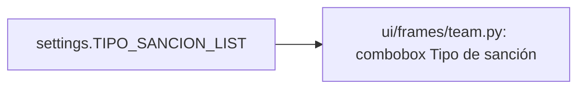

### CRITICIDAD_LIST


### DETAIL_LOOKUP_ALIASES (tabla de referencia para buscar catálogos)
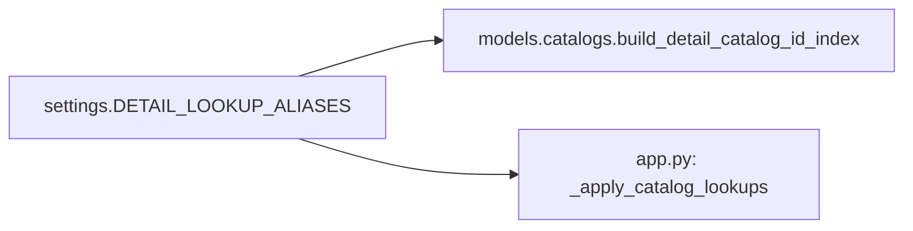

## Catálogo de analíticas contables

### ANALITICA_CATALOG
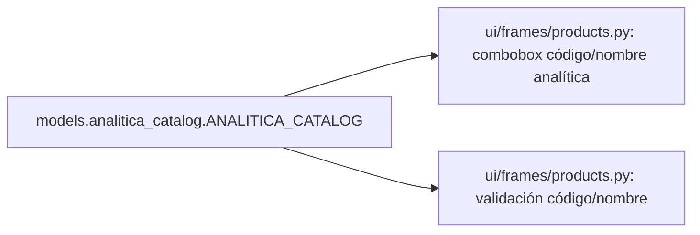

## Catálogos de colaboradores (estáticos)

### TEAM_HIERARCHY_CATALOG (división → área → servicio → puesto)
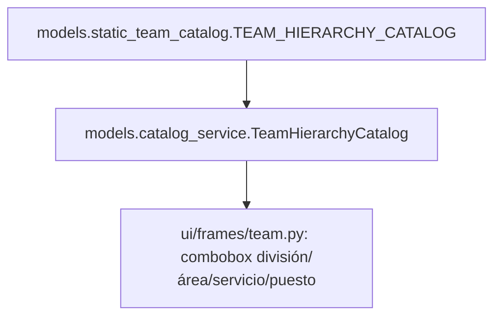

### AGENCY_CATALOG (nombre → código)
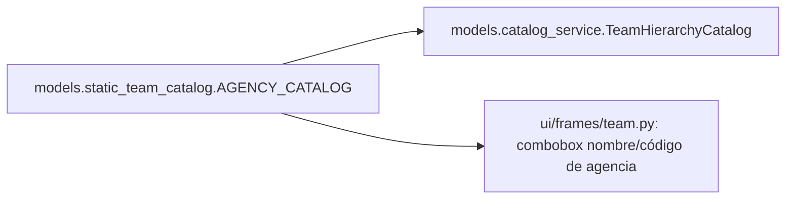

## Catálogos de detalle (archivos *_details.csv)

Estos archivos son cargados por `models.catalogs.load_detail_catalogs` y normalizados
por `models.catalog_service.CatalogService`. El resultado se distribuye a los
frames para autopoblado.

### client_details.csv
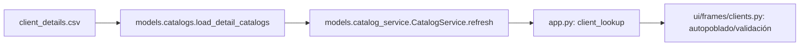

### team_details.csv
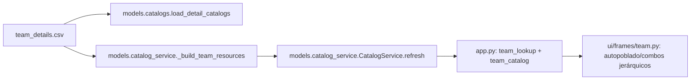

### risk_details.csv
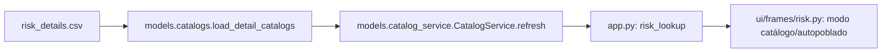

### norm_details.csv
```mermaid
flowchart LR
    file["norm_details.csv"] --> load["models.catalogs.load_detail_catalogs"]
    load --> svc["models.catalog_service.CatalogService.refresh"]
    svc --> app["app.py: norm_lookup"]
    app --> ui["ui/frames/norm.py: autopoblado/validación"]
```

### claim_details.csv
```mermaid
flowchart LR
    file["claim_details.csv"] --> load["models.catalogs.load_detail_catalogs"]
    load --> svc["models.catalog_service.CatalogService.refresh"]
    svc --> app["app.py: claim_lookup"]
    app --> ui["ui/frames/products.py: autopoblado de reclamos"]
```

### process_details.csv
```mermaid
flowchart LR
    file["process_details.csv"] --> load["models.catalogs.load_detail_catalogs"]
    load --> svc["models.catalog_service.CatalogService.refresh"]
    svc --> app["app.py: process_lookup + autopoblado de proceso"]
    app --> ui["ui/frames/case.py: ID de proceso + catálogo"]
```

### product_details.csv (referenciado si está disponible)
```mermaid
flowchart LR
    file["product_details.csv"] --> load["models.catalogs.load_detail_catalogs"]
    load --> svc["models.catalog_service.CatalogService.refresh"]
    svc --> app["app.py: product_lookup"]
    app --> ui["ui/frames/products.py: autopoblado de productos"]
```
