# Validaciones y reglas de negocio (Mermaid)

Este documento resume **todas las validaciones y reglas cruzadas** encontradas en el
código para el formulario Tkinter. Se tomó como referencia el **Design document CM.pdf**
(ubicado en la raíz del repositorio) y se verificó que las validaciones de formato
requeridas por dicho documento existen en la implementación actual.

> **Nota de comportamiento:** las validaciones no se ejecutan al inicio, sino
> **después de una edición de campo**. Esto se logra con `FieldValidator`, que
> reacciona a `FocusOut`, selección de combobox y eventos de edición/pegado.

## 1) Ciclo general de validación en UI

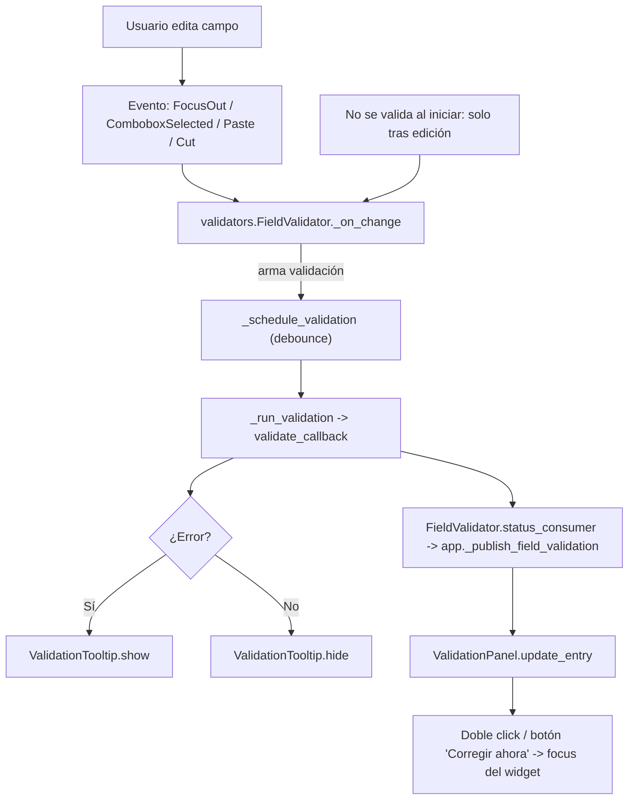

**Fuentes:** `validators.py` (FieldValidator y validadores) y `app.py` (ValidationPanel + `_publish_field_validation`).

## 2) Panel de validación (UI)

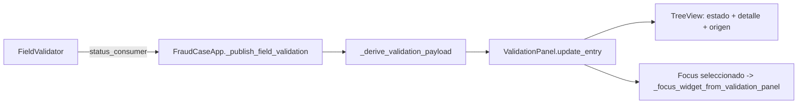

**Reglas clave:**
- Si el widget es un combobox y el valor está vacío, se marca como error.
- Cada entrada tiene severidad (`ok`, `warning`, `error`) y puede mapearse a un widget.

**Fuentes:** `app.py` (ValidationPanel, `_publish_field_validation`).

## 3) Validaciones de formato base (Design document CM.pdf)

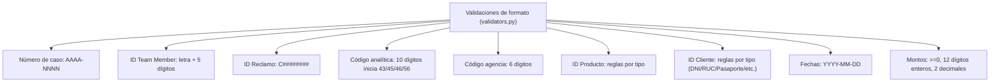

**Fuentes:** `validators.py`.

## 4) Validaciones por sección

### 4.1 Caso (CaseFrame + app.validate_data)

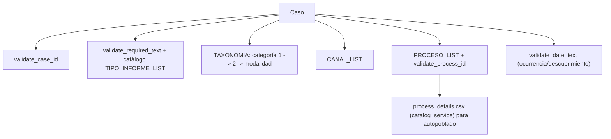

**Reglas destacadas (Design document CM.pdf):**
- Fechas en formato `YYYY-MM-DD`.
- Ocurrencia < Descubrimiento y ambas ≤ hoy (aplicado por `validate_date_text` + `validate_product_dates`).

**Fuentes:** `ui/frames/case.py`, `validators.py`, `app.py`.

### 4.2 Clientes (ClientFrame + app.validate_data)

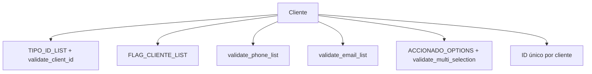

**Fuentes:** `ui/frames/clients.py`, `validators.py`, `app.py`.

### 4.3 Colaboradores (TeamMemberFrame + app.validate_data)

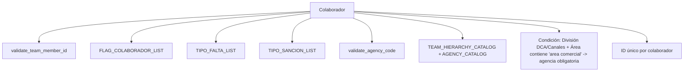

**Fuentes:** `ui/frames/team.py`, `validators.py`, `app.py`.

### 4.4 Productos (ProductFrame + app.validate_data)

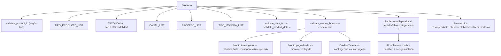

**Fuentes:** `ui/frames/products.py`, `validators.py`, `app.py`.

### 4.5 Reclamos (ClaimRow)

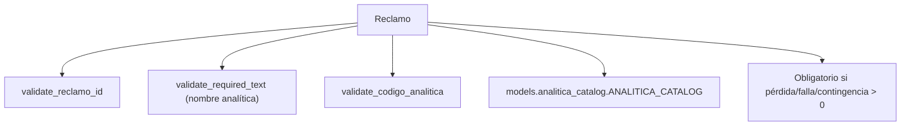

**Fuentes:** `ui/frames/products.py`, `models/analitica_catalog.py`, `validators.py`.

### 4.6 Involucramientos (colaboradores/clientes)

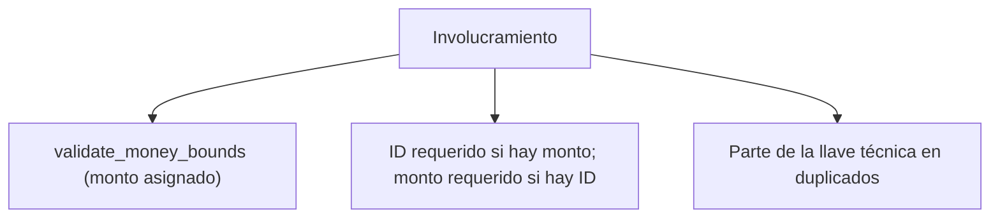

**Fuentes:** `ui/frames/products.py`, `app.py`.

### 4.7 Riesgos

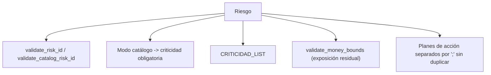

**Fuentes:** `ui/frames/risk.py`, `validators.py`, `app.py`.

### 4.8 Normas

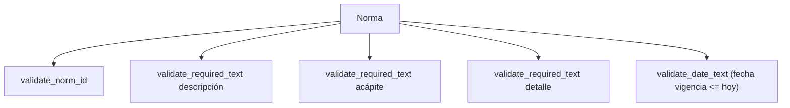

**Fuentes:** `ui/frames/norm.py`, `validators.py`, `app.py`.

## 5) Llave técnica y duplicados (Design document CM.pdf)

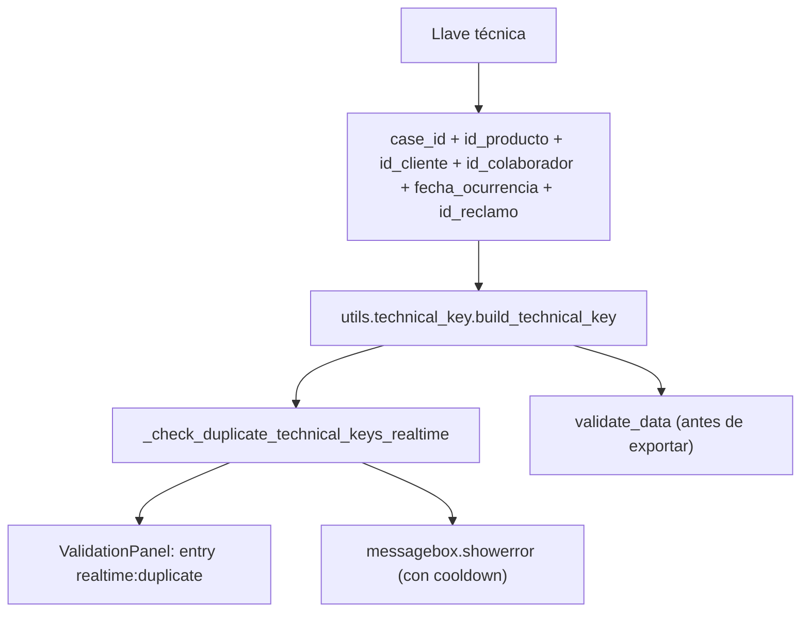

**Fuentes:** `utils/technical_key.py`, `app.py`.

## 6) Validación antes de exportar y botones críticos

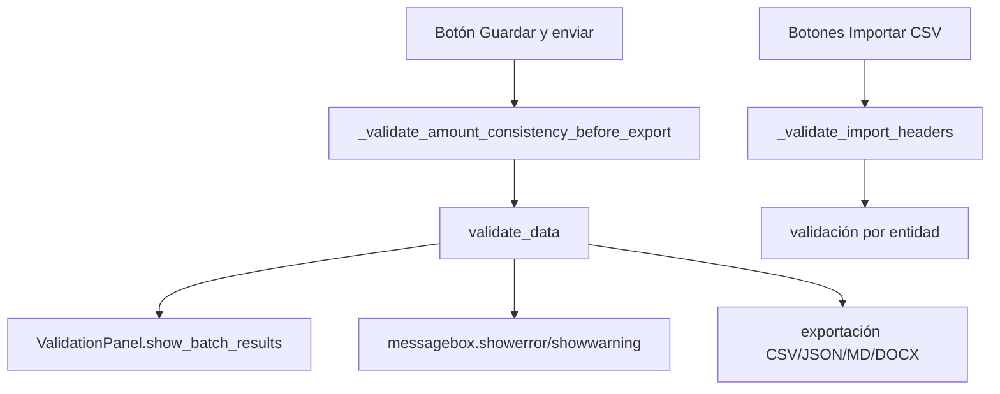

**Fuentes:** `app.py`, `utils/persistence_manager.py`.

## 7) Reglas cruzadas clave (Design document CM.pdf)

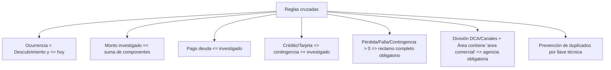

**Fuentes:** `ui/frames/products.py`, `validators.py`, `app.py`.

## 8) Validación post-edición (no en startup)

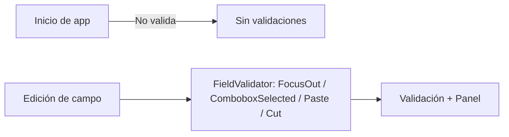

**Fuentes:** `validators.py`, `app.py`.
